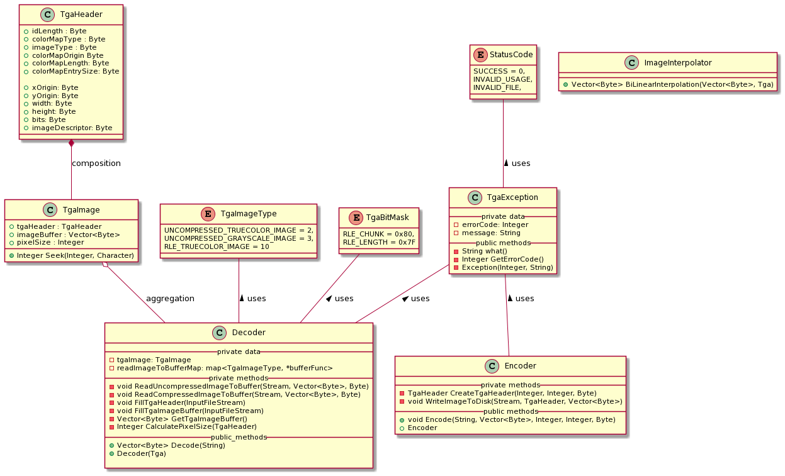

# TGA image half-sizing implementation

<!-- TABLE OF CONTENTS -->
<details open="open">
  <summary>Table of Contents</summary>
  <ol>
    <li>
      <a href="#introduction">Introduction</a>
    </li>
    <li>
      <a href="#background">Background</a>
      <ul>
        <li><a href="#tgaimageformat">TGA Image Format</a></li>
        <li><a href="#halfsizingalgorithm">Half-sizing Algorithm</a></li>
      </ul>
    </li>
    <li>
      <a href="#systemdesign">System Design</a>
      <ul>
        <li><a href="#architecture">Architecture</a></li>
        <li><a href="#diagrams">Diagrams</a></li>
      </ul>
    </li>
    <li>
      <a href="#usage">Usage</a>
      <ul>
        <li><a href="#prerequisites">Prerequisites</a></li>
        <li><a href="#installation">Installation</a></li>
      </ul>
    </li>
    <li><a href="#contact">Contact</a></li>
  </ol>
</details>


<!-- Introduction-->
## Introduction

The main scope of this project is implementing a command-line tool in C++ language that resizes a given TGA image by half of the original dimensions.
In the following sections, a brief background for the TGA image format and the resizing algorithm will be explained. After that, the system design section will
highlight design decisions.

## Background

### TGA Image Format

Truevision TGA, TARGA, the image format was created by Truevision Inc. in the early '80s. The format can store image data with 8, 15, 16, 24, and 32 bits of precision per pixel.
Color data can be stored as color mapped or true color data. In addition, image data could be stored as raw bytes, or as a compressed byte which is encoded by [RLE](https://en.wikipedia.org/wiki/Run-length_encoding).
According to the [TGA specification](http://tfc.duke.free.fr/coding/tga_specs.pdf) a TGA image file is composed of 18 bytes header section which stores the image data properties, and a color map and image data section
depending on the image type. As it can be seen from the specification, there are 6 different image types; uncompressed grayscale, color mapped, RGB images and compressed grayscale, color mapped, RGB images. In the scope of this project, compressed RBG, compressed grayscale,  uncompressed RGB, and uncompressed grayscale images will be handled.

### Half-sizing Algorithm

To reduce to image size by half in each dimension, it is required to apply a resampling algorithm to the image. One of the simplest algorithms for downscaling is [Nearest-neighbor interpolation](https://en.wikipedia.org/wiki/Nearest-neighbor_interpolation). In basic terms, nearest-neighbor interpolation will only take closes pixel value and average it with the current pixel value. For example, if we think of the following image as a simple 4x4 image, arrows on the image are denoting pixels are taken into account if the nearest-neighbor interpolation is applied.

<p align="center">
  
</p>

However, as it can be deducted from the image algorithm is ignoring all the adjacent pixels, and will simply output a poorly reduced image as a result. Therefore, it is decided to use another resampling algorithm for downscaling which will provide better quality, and also will be not computationally expensive. As a result, [Bilinear interpolation](https://en.wikipedia.org/wiki/Bilinear_interpolation) is selected as a resampling algorithm in the project. Bilinear interpolation considers the closest 2x2 neighborhood of known pixel values to calculate the average pixel value. Since we aim to reduce the image size by half, we are only interested in every alternating pixel value. It can be depicted in the following image by using the previous example again.


<p align="center">
  
</p>

## System Design

### Architecture

Since the project's scope is to reduce a given Targa image size by half, it will be helpful to separate the image reading and writing part from the image processing. The designed system consist of three subsystems which can be listed as follows:

    - Decoder: Reads the Targa image file and populates the necessary fields.
    - Image Processor: Applies half-sizing algorithm.
    - Encoder: Constructs a Targa image file and writes it to the disk.

### Diagrams

The UML class and sequence diagram of the designed system is given in the following pictures.

<p align="center">
  
</p>

<p align="center">
  
</p>

## Usage

The project is implemented in C++ and considers portability as a first principle. Therefore, it is possible to use it on any operating system.

### Prerequisites

- C++17 supporting compiler
- CMake 3.2 or above

### Installation

After unzip or cloning the project to a directory, simply apply the following steps:

For Linux/Mac OS:

- ```mkdir build & cd build```
- ```cmake ..```
- ```make & make install```
- ```cd ../bin & ./halfsize <imagefile.tga>```

<!-- CONTACT -->
## Contact

Ozan Tanfener - ozan.tanfener@gmail.com


